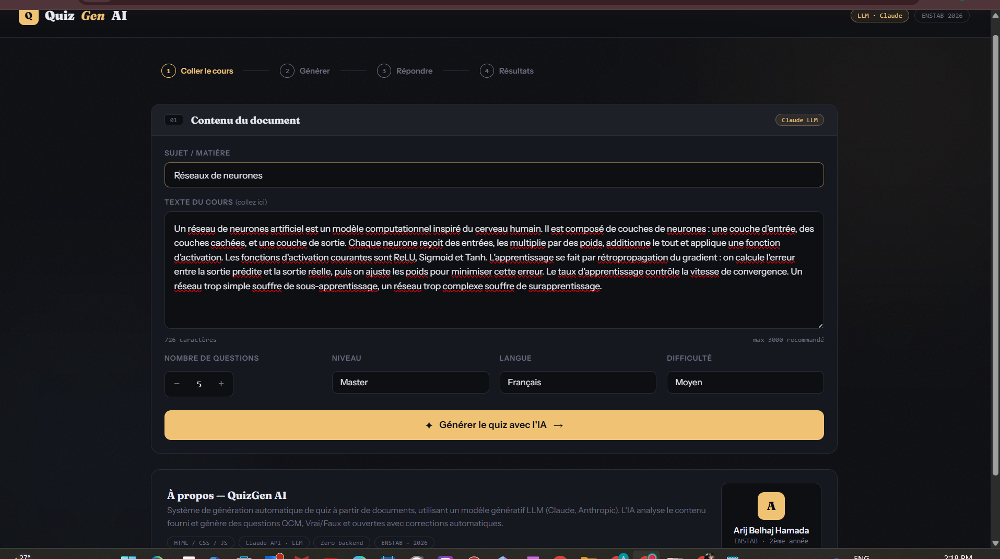
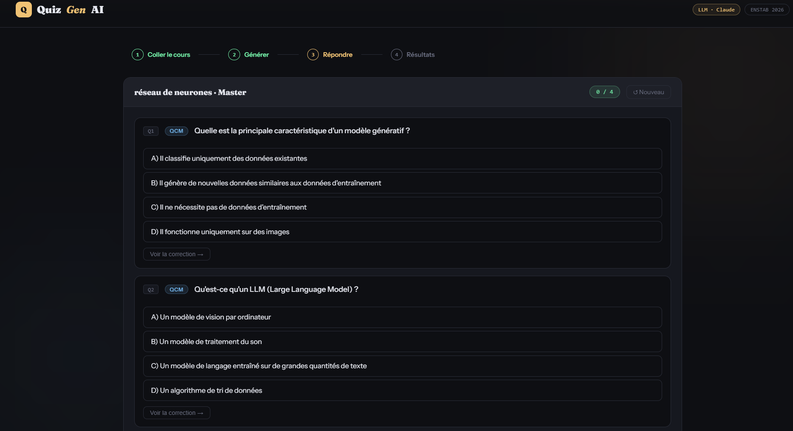
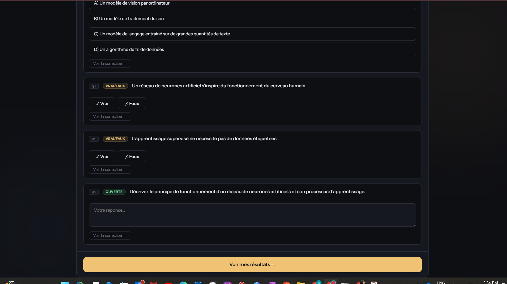
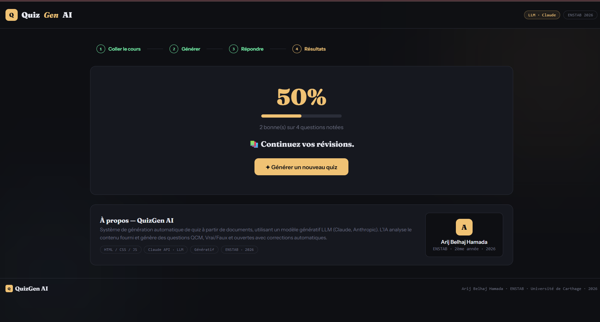

# ✦ QuizGen AI — Générateur Automatique de Quiz

> Projet IA individuel · ENSTAB · Université de Carthage · 2025–2026

## 📸 Captures d'écran

### Interface principale


### Quiz généré


### Quiz généré (suite)


### Quiz généré (détail)


### Résultats
\---

## 🎯 Description

**QuizGen AI** est une application web qui génère automatiquement des quiz interactifs à partir du contenu d'un cours, en utilisant un **modèle génératif LLM** (Claude — Anthropic).

L'utilisateur colle un extrait de cours, choisit le nombre et le type de questions, et l'IA génère instantanément un quiz complet avec corrections automatiques et score final.

\---

## ✨ Fonctionnalités

* 🤖 Génération par LLM (Claude Sonnet — Anthropic)
* 📝 3 types de questions : QCM, Vrai/Faux, Questions ouvertes
* ✅ Correction interactive en temps réel
* 🎯 Score automatique et résultats détaillés
* 🌐 Multilingue (Français / Anglais)
* 📊 Niveaux : Lycée, Licence, Master, Doctorat
* 💡 Explications pour chaque réponse
* 🔄 Génération illimitée

\---

## 🚀 Utilisation

Ouvrir directement : [**Démo live**](https://VOTRE_USERNAME.github.io/quizgen-ai)

Ou cloner et ouvrir `index.html` dans le navigateur.

\---

## 🏗️ Architecture

```
quizgen-ai/
├── index.html      # Application complète (HTML + CSS + JS)
├── assets/         # Screenshots
└── README.md
```

**Pipeline :**

```
\[Texte du cours] → \[Prompt engineering] → \[Claude LLM]
       ↓
\[JSON structuré] → \[Rendu interactif] → \[Score \& résultats]
```

\---

## 🧠 Modèle génératif

|Paramètre|Valeur|
|-|-|
|Modèle|`claude-sonnet-4-20250514`|
|Type|LLM (Large Language Model)|
|Fournisseur|Anthropic|
|Format sortie|JSON structuré|

\---

## 👤 Auteure

**Arij Belhaj Hamada**
ENSTAB — École Nationale des Sciences et Technologies Avancées de Borj Cédria
Université de Carthage · 2ème année ingénierie · 2025–2026
Prof : Mme Amira Echtioui

\---

## 📅 Date de remise

**31 mai 2026**

